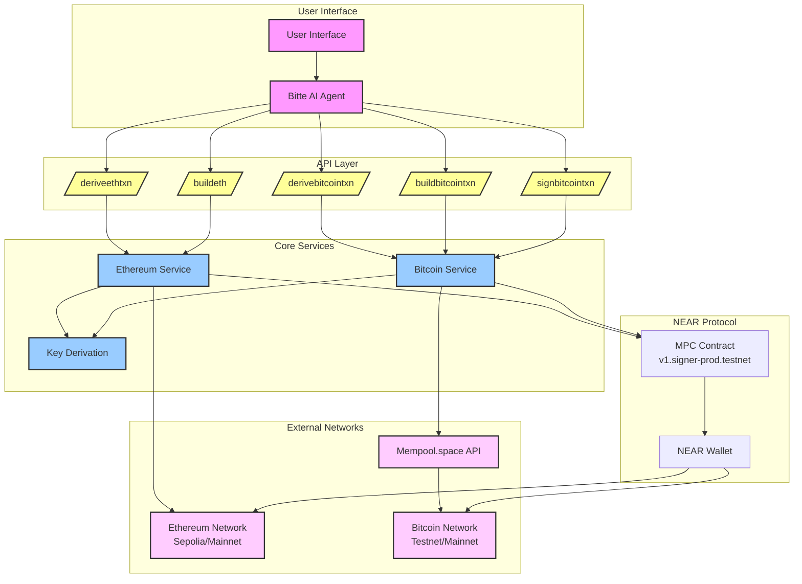

# MultiChain AI Agent on Near 

Built using Bitte , Helps the users Build and Execute Transactions on Bitcoin and EVM Chains.

Check the [docs](https://docs.bitte.ai/agents/quick-start) 

## Features

1. Get your derived Bitcoin address and Ethereum address with your choosen path.


2. Generate any type of multichain transaction and then sign it directly from your near wallet.

Below is an ethereum transaction generated using the prompt 

```
build an ethereum transaction to transfer 0.001 eth to 0x67E6FB17f0ff00C2fA8484C3A1a0A24FE9a817bf using path=ethereum-1
```


3. Generate  a Bitcoin transaction utilising the Bitte AI Agent 

```
create a bitcoin transaction to transfer 0.001 btc to tb1qrpdxac4tx7atld37stgmt3ywfjk76efd9050rl with path=bitcoin-1
```

The **MultiChain AI Agent on NEAR** leverages AI for seamless blockchain interoperability, advanced DeFi possibilities, and enhanced UX, aligning well with various hackathon bounties, particularly in **Chain Abstraction, Best of AI, Best DeFi, and Chain Agnostic Track** categories. 

With the growing demand for multi-chain solutions and simplified blockchain interactions, this project offers a comprehensive tool for both everyday users and DeFi enthusiasts.

### Flow 


### Use Cases

### 1. **Cross-Chain Transaction Management**
   - **Use Case**: Allows users to seamlessly build, sign, and execute transactions on both Bitcoin and Ethereum through a unified NEAR interface.
   - **Example**: Users can generate and send assets across different blockchains using natural language commands, making it easy to manage multi-chain interactions.

### 2. **Chain Abstraction for Better UX**
   - **Use Case**: Simplifies blockchain interactions by letting users manage assets and execute transactions on Bitcoin and EVM-compatible chains directly from NEAR.
   - **Example**: Users can manage Bitcoin and Ethereum assets without needing cross-chain bridges, streamlining transactions and reducing technical barriers.

### 3. **On-Chain AI-Powered Agents**
   - **Use Case**: Enables developers to create intelligent, multi-chain agents that can autonomously execute transactions, monitor balances, and manage assets across chains.
   - **Example**: An AI agent that monitors gas prices across chains to optimize transaction costs or provides trading signals for better asset management.

### 4. **Secure Multi-Chain DeFi Interactions**
   - **Use Case**: Empowers DeFi users to perform complex financial operations like lending, borrowing, and liquidity provision across chains without navigating different wallets.
   - **Example**: Users can create a Bitcoin-backed loan on Ethereum, or generate multi-chain yield farming transactions via simple commands.

### 5. **Cross-Chain DAO and Voting Mechanisms**
   - **Use Case**: Extends DAOs on NEAR to interact with assets on Bitcoin and Ethereum, allowing decentralized governance across chains.
   - **Example**: A DAO on NEAR can vote on a proposal that triggers a Bitcoin purchase or an Ethereum contract execution, centralizing governance across ecosystems.

### 6. **Programmable Yield Aggregation and Management**
   - **Use Case**: Offers cross-chain yield farming and liquidity management, allowing users to maximize yields through AI-based decision-making.
   - **Example**: An agent that identifies optimal yield opportunities on Ethereum and moves liquidity based on predefined conditions.

### 7. **Enhanced Security and Data Privacy**
   - **Use Case**: With NEAR's infrastructure and Calimero’s privacy capabilities, secure multi-chain transactions can be maintained with user data privacy.
   - **Example**: A private payroll or DAO voting system where sensitive transaction data remains confidential, enhancing security for enterprise-grade applications.

### 8. **User-Friendly Interface for Multi-Chain Operations**
   - **Use Case**: A chatbot-like interface that allows users to manage multi-chain interactions and perform complex transactions via natural language.
   - **Example**: Users can ask, "Generate my Bitcoin address," or "Send 0.001 BTC," simplifying their experience without requiring blockchain expertise.

### 9. **AI Agent Plugins for Enhanced Wallet Capabilities**
   - **Use Case**: Enables wallet customization with AI-driven plugins, enhancing functionality for cross-chain DeFi.
   - **Example**: A plugin that optimizes gas usage by analyzing transactions across networks and suggesting efficient routes for users.

### 10. **Hackers’ Choice and Community Engagement**
   - **Use Case**: The project’s multi-chain and AI features could draw community interest, especially if positioned as an engaging, user-owned financial tool.
   - **Example**: By promoting ease of use and advanced DeFi capabilities, it can attract both novice and experienced crypto users, increasing the chances for community support and Hacker’s Choice votes.
